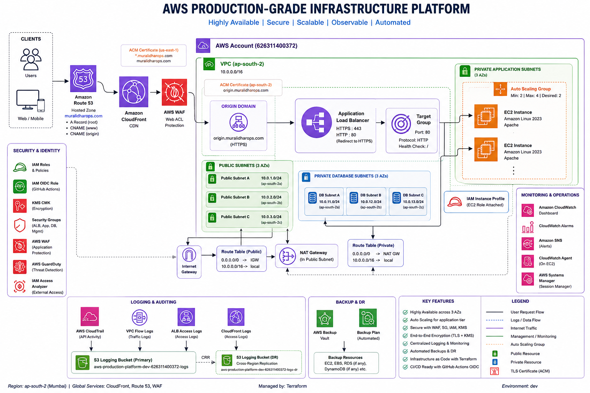
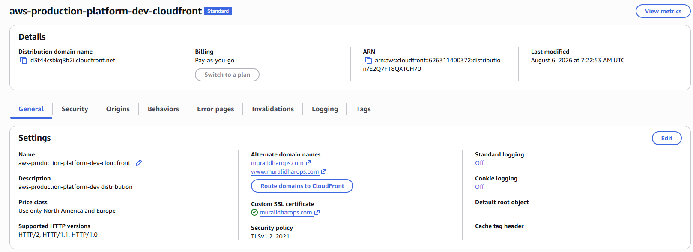
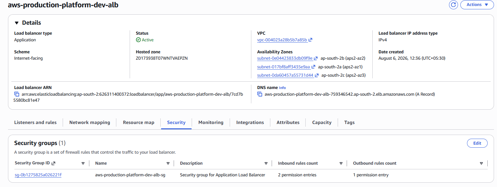
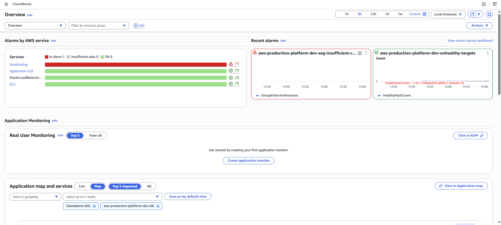
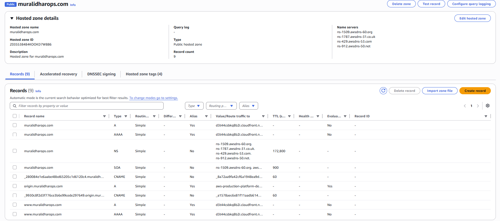
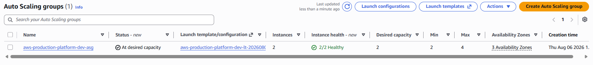

# 🚀 AWS Production-Grade Infrastructure Platform


## Architecture



## 📖 Project Overview

This project demonstrates the design and implementation of a **production-grade AWS infrastructure platform** using **Terraform** following Infrastructure as Code (IaC) best practices.

The platform is designed with high availability, scalability, security, observability, and disaster recovery in mind. It provisions a complete cloud environment capable of hosting highly available web applications behind an Application Load Balancer and Amazon CloudFront, protected by AWS WAF, monitored with CloudWatch, audited using CloudTrail, and secured using IAM and AWS KMS.

The infrastructure follows a modular Terraform design, making every component reusable, maintainable, and easy to extend for additional environments such as **Development**, **Staging**, and **Production**.

## 🎯 Project Objectives

- Build reusable Terraform modules
- Implement Infrastructure as Code (IaC)
- Design a highly available AWS architecture
- Automate deployments using Terraform
- Secure workloads using AWS security best practices
- Centralize monitoring and logging
- Enable automated backups
- Support multiple environments
- Prepare for GitHub Actions CI/CD

## ✨ Key Features

### Networking

- Amazon VPC
- Three Public Subnets
- Three Private Application Subnets
- Three Private Database Subnets
- Internet Gateway
- NAT Gateway
- Route Tables

### Compute

- Auto Scaling Group
- Launch Template
- Amazon Linux 2023
- EC2 IAM Instance Profile

### Load Balancing

- Application Load Balancer
- HTTP to HTTPS Redirect
- HTTPS Listener
- Target Groups

### DNS & CDN

- Amazon Route53
- Amazon CloudFront
- AWS Certificate Manager
- Custom Domain

### Security

- AWS WAF
- IAM Roles
- Security Groups
- AWS KMS

### Monitoring

- Amazon CloudWatch Dashboard
- CloudWatch Alarms
- SNS Notifications
- CloudWatch Agent

### Logging

- AWS CloudTrail
- VPC Flow Logs
- ALB Access Logs
- CloudFront Logs

### Backup & DR

- AWS Backup
- Backup Vault
- Cross-Region Log Replication

### Automation

- Modular Terraform Design
- Multi-Environment Support
- GitHub OIDC Integration

## 🛠 Technology Stack

| Category | Technologies |
|----------|--------------|
| Infrastructure | AWS |
| IaC | Terraform |
| Compute | Amazon EC2 |
| Networking | Amazon VPC |
| Load Balancing | Application Load Balancer |
| CDN | Amazon CloudFront |
| DNS | Amazon Route53 |
| Security | AWS WAF, IAM, KMS |
| Monitoring | CloudWatch |
| Logging | CloudTrail, VPC Flow Logs | 
| Backup | AWS Backup |
| Authentication | GitHub OIDC |
| OS | Amazon Linux 2023 |

## 📂 Repository Structure

```text
aws-production-platform/
├── bootstrap/
├── environments/
│   ├── dev/
│   ├── staging/
│   └── prod/
├── modules/
│   ├── network/
│   ├── security/
│   ├── alb/
│   ├── cloudfront/
│   ├── route53/
│   ├── compute/
│   ├── monitoring/
│   ├── logging/
│   ├── backup/
│   ├── waf/
│   └── ...
├── scripts/
├── docs/
│   ├── diagrams/
│   ├── screenshots/
│   └── runbooks/
├── README.md
└── Makefile
```

## 🧩 Terraform Module Overview

The infrastructure is organized into reusable Terraform modules, each responsible for a specific AWS service or capability.

| Module | Purpose |
|---------|---------|
| `network` | Creates the VPC, subnets, route tables, Internet Gateway, NAT Gateway, and VPC Flow Logs. |
| `security` | Creates security groups for the ALB, application servers, database tier, and management access. |
| `compute` | Deploys the Launch Template, Auto Scaling Group, EC2 instances, IAM instance profile, and target group attachments. |
| `alb` | Provisions the Application Load Balancer, HTTP and HTTPS listeners, listener rules, target groups, and ALB access logging. |
| `route53` | Creates the hosted zone and DNS records for the root domain, `www`, and the ALB origin endpoint. |
| `cloudfront` | Creates the CloudFront distribution, configures caching behavior, HTTPS, logging, and integrates with AWS WAF. |
| `acm` | Requests and validates the ACM certificate for CloudFront in the `us-east-1` region. |
| `acm-regional` | Requests and validates the regional ACM certificate used by the Application Load Balancer. |
| `waf` | Creates the AWS WAF Web ACL and associates it with CloudFront. |
| `logging` | Creates S3 buckets for ALB, CloudTrail, and CloudFront logs with encryption, lifecycle policies, and replication support. |
| `monitoring` | Creates CloudWatch dashboards, alarms, SNS topics, and monitoring resources. |
| `cloudtrail` | Configures CloudTrail with encrypted log storage in Amazon S3. |
| `backup` | Creates AWS Backup Vaults, IAM roles, backup plans, and resource selections. |
| `kms` | Creates customer-managed KMS keys and aliases used throughout the platform. |
| `iam` | Creates IAM roles, policies, and instance profiles required by platform services. |
| `github-oidc` | Creates the IAM role used by GitHub Actions through OpenID Connect federation. |
| `config` | Configures AWS Config for continuous resource compliance evaluation. |
| `cloudwatch-agent` | Installs and configures the CloudWatch Agent on EC2 instances. |
| `disaster-recovery` | Creates resources required for disaster recovery, including log replication. |
| `ssm` | Configures AWS Systems Manager for secure instance management. |

## 🚀 Deployment Workflow

The infrastructure is provisioned in the following order:

```text
Bootstrap
    │
    ▼
Terraform Backend
    │
    ▼
Networking
    │
    ▼
Security Groups
    │
    ▼
KMS
    │
    ▼
Logging
    │
    ▼
CloudTrail
    │
    ▼
IAM
    │
    ▼
Compute
    │
    ▼
Application Load Balancer
    │
    ▼
Regional ACM
    │
    ▼
CloudFront ACM
    │
    ▼
CloudFront
    │
    ▼
Route53
    │
    ▼
Monitoring
    │
    ▼
Backup
    │
    ▼
GuardDuty
    │
    ▼
Access Analyzer
```

## ⚙️ Deployment

### Clone the Repository

```bash
git clone <repository-url>
cd aws-production-platform
```

### Bootstrap the Backend

```bash
cd bootstrap
terraform init
terraform apply
```

### Deploy the Development Environment

```bash
cd ../environments/dev

terraform init

terraform validate

terraform plan -out=tfplan

terraform apply tfplan
```

## 🧹 Destroy Infrastructure

```bash
terraform destroy
```

> **Note:** If a Route53 hosted zone is recreated during a future deployment, update the domain registrar (GoDaddy) with the new AWS Route53 name servers before ACM certificate validation can complete.

## ✅ Validation Checklist

After deployment, verify the following:

- Route53 hosted zone created
- Domain name servers updated
- ACM certificates issued
- CloudFront distribution deployed
- WAF associated with CloudFront
- ALB listeners configured
- EC2 instances healthy
- Auto Scaling Group healthy
- CloudTrail logging enabled
- VPC Flow Logs active
- CloudWatch dashboard created
- AWS Backup Vault created
- ALB access logs delivered to Amazon S3

## 🔍 Useful Validation Commands

### Check ACM Certificate

```bash
aws acm describe-certificate --certificate-arn <certificate-arn>
```

### Check Target Health

```bash
aws elbv2 describe-target-health \
  --target-group-arn <target-group-arn>
```

### Verify ALB Access Logs

```bash
aws s3 ls s3://<logging-bucket>/alb/ --recursive
```

### Verify CloudTrail

```bash
aws cloudtrail get-trail-status \
  --name <trail-name>
```

### Verify VPC Flow Logs

```bash
aws ec2 describe-flow-logs
```

## 🔒 Security Architecture

The platform follows AWS security best practices to protect infrastructure, applications, and data.

### Identity & Access Management

- IAM Roles for EC2 instances
- IAM Instance Profiles
- GitHub Actions authentication using OpenID Connect (OIDC)
- Least-privilege IAM policies

### Network Security

- Public Application Load Balancer
- Private EC2 instances
- Security Groups with least-privilege access
- No direct SSH access to application servers
- Systems Manager (SSM) for instance management

### Encryption

- Customer-managed AWS KMS key
- Encrypted S3 buckets
- Encrypted CloudTrail logs
- Encrypted ALB access logs
- TLS certificates managed through AWS Certificate Manager

### Perimeter Protection

- AWS WAF protecting CloudFront
- HTTPS enforced end-to-end
- HTTP redirected to HTTPS
- CloudFront as the public entry point

### Security Monitoring

The platform currently implements:

- AWS CloudTrail for API auditing
- CloudWatch monitoring and alerting
- VPC Flow Logs for network visibility
- AWS WAF protecting CloudFront
- Customer-managed KMS encryption
- IAM least-privilege access controls

> **Future Enhancement:** Amazon GuardDuty and IAM Access Analyzer can be integrated to provide continuous threat detection and external access analysis.

## 📊 Monitoring & Observability

The platform provides centralized monitoring and logging using native AWS services.

### CloudWatch

- CloudWatch Dashboard
- CloudWatch Metrics
- CloudWatch Alarms
- CloudWatch Agent

### Logging

- Application Load Balancer Access Logs
- CloudTrail
- VPC Flow Logs
- CloudFront Logs

### Notifications

Amazon SNS is configured to deliver infrastructure alerts generated by CloudWatch alarms.

## 💾 Backup & Disaster Recovery

The platform includes disaster recovery capabilities.

### Backup

- AWS Backup Vault
- Backup IAM Role
- Scheduled backup plans
- Automated recovery point management

### Log Protection

- S3 Lifecycle Policies
- Cross-Region Replication
- Versioning enabled
- Server-side encryption

### Disaster Recovery Strategy

- Infrastructure can be recreated using Terraform
- Infrastructure state stored remotely
- Modular Terraform design supports environment recreation

## 🧠 Challenges & Lessons Learned

During the implementation of this platform, several real-world operational challenges were encountered and resolved.

### Route53 Hosted Zone Recreation

Destroying and recreating the infrastructure generated a new Route53 hosted zone with different name servers.

**Resolution**

Updated the GoDaddy domain to use the new Route53 name servers before ACM validation.

---

### ACM Certificate Validation

The regional ACM certificate remained in `PENDING_VALIDATION` until DNS propagation completed.

**Resolution**

Verified the ACM validation CNAME records in Route53 and confirmed DNS propagation before Terraform resumed successfully.

---

### ALB Access Log Permissions

The Application Load Balancer initially failed to enable access logging due to insufficient S3 bucket permissions.

**Resolution**

Updated the S3 bucket policy to allow the ALB log delivery service to perform:

- GetBucketAcl
- PutObject

Also adjusted encryption settings to ensure compatibility.

---

### Terraform State Recovery

Terraform marked the ALB as **tainted** after an interrupted deployment.

**Resolution**

Reviewed the Terraform state, removed the tainted resource, and reapplied the configuration successfully.

---

### DNS Propagation

Certificate validation timing depended on DNS propagation after updating registrar name servers.

**Resolution**

Verified propagation using:

- dig
- nslookup
- Route53 hosted zone records

before continuing the deployment.

## 🚀 Future Enhancements

Planned improvements include:

- Amazon RDS
- Amazon ElastiCache
- Amazon ECR
- Amazon ECS
- Amazon EKS
- Blue/Green Deployments
- Canary Deployments
- AWS Secrets Manager
- HashiCorp Vault
- GitHub Actions CI/CD
- Terraform Cloud
- Multi-Region Failover
- AWS Shield Advanced
- IAM Access Analyzer
- AWS Config
- AWS Security Hub
- AWS Shield Advanced
- Cost Optimization Dashboard

## 📷 Screenshots

### Architecture


### CloudFront Distribution



### Application Load Balancer



### CloudWatch Dashboard



### Route53 Hosted Zone



### Auto Scaling Group



## 📄 License

This project is licensed under the MIT License.

## 👨‍💻 Author

**Muralidhar**

AWS | DevOps | Terraform | Infrastructure as Code

This project was built as a hands-on implementation of a production-grade AWS infrastructure platform using Terraform, following AWS Well-Architected Framework principles and Infrastructure as Code best practices.
